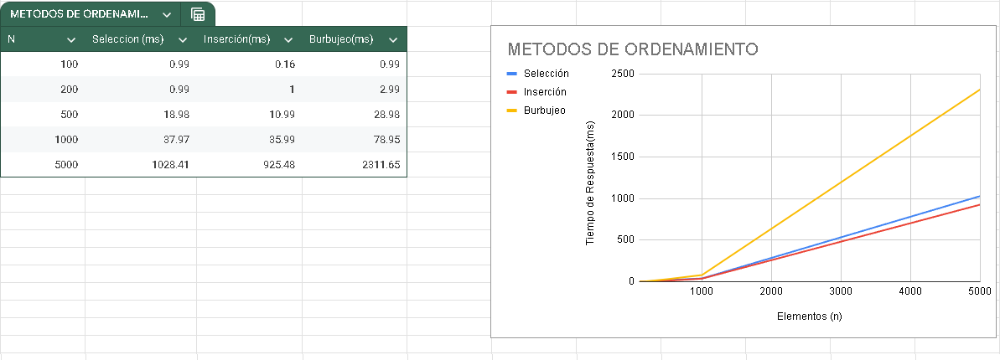

# 📘 TP1 – 2da Parte  
## Métodos de Ordenamiento

### 📌 Objetivo
Implementar una clase `Vector` que contenga:  
- Un atributo principal: un arreglo de enteros.  
- Tres métodos de ordenamiento:  
  - Selección  
  - Inserción  
  - Burbujeo  

Además:  
- Generar casos de prueba con vectores en distintos estados:  
  - Ordenado  
  - Completamente desordenado  
  - Aleatorio  
- Realizar pruebas experimentales y graficar la relación **T = f(N)** para verificar la complejidad de los algoritmos.

---

### 🛠️ Implementación

```python
import random
import time

class Vector:
    def __init__(self):
        self.vector = []
    
    def orden_seleccion(self):
        n = len(self.vector)
        for i in range(n):
            min_idx = i
            for j in range(i + 1, n):
                if self.vector[j] < self.vector[min_idx]:
                    min_idx = j
            self.vector[i], self.vector[min_idx] = self.vector[min_idx], self.vector[i]
        return self.vector

    def orden_insercion(self):
        n = len(self.vector)
        for i in range(1, n):
            x = self.vector[i]
            j = i - 1
            while j >= 0 and x < self.vector[j]:
                self.vector[j + 1] = self.vector[j]
                j -= 1
            self.vector[j + 1] = x

    def orden_burbujeo(self):
        n = len(self.vector)
        for i in range(n):
            intercambio = False
            for j in range(0, n - i - 1):
                if self.vector[j] > self.vector[j + 1]:
                    self.vector[j], self.vector[j + 1] = self.vector[j + 1], self.vector[j]
                    intercambio = True
            if not intercambio:
                break
        return self.vector

    def generar_ordenado(self, n):
        self.vector = list(range(n))
    
    def generar_desordenado(self, n):
        self.vector = list(range(n, 0, -1))
    
    def generar_random(self, n):
        self.vector = [random.randint(0, 100) for _ in range(n)]
```

---

### 🧪 Casos de Prueba

#### 1. Verificación de correcto ordenamiento (N pequeño)
Se generan vectores aleatorios de tamaño 5, se ordenan con cada método y se imprimen antes y después para comprobación visual.

#### 2. Medición de tiempos (N = 5000)
Para cada tipo de vector (ordenado, desordenado invertido, aleatorio) se ejecutan los tres algoritmos y se mide el tiempo en milisegundos. Cada medición parte de un vector nuevo para garantizar condiciones iniciales idénticas.

**Ejemplo de salida:**
```
--- Vector RANDOM (N=5000) ---
Selección tardó 45.67890 ms
Inserción tardó 38.12345 ms
Burbujeo tardó 89.45678 ms
```

Cada caso se prueba con los tres métodos de ordenamiento y se mide el tiempo de ejecución.

---

## 📊 Resultados Experimentales



*Gráfico 1. Relación entre el tamaño del vector (N) y el tiempo de ejecución (T) para los algoritmos de selección, inserción y burbujeo. Se observa un crecimiento cuadrático, confirmando la complejidad teórica O(N²).*

---

### 📈 Conclusiones

- Los tres algoritmos presentan complejidad **O(n²)** en el peor caso.  
- El ordenamiento por inserción puede ser más eficiente en vectores casi ordenados.  
- El burbujeo es el menos eficiente en la mayoría de los casos.  
- Los resultados experimentales confirman la teoría de complejidad.  

---
